# Sistema de Gestión de Pacientes

Aplicación de escritorio desarrollada en C# y Windows Forms para la práctica final de Programación Básica de la Universidad Central del Este (UCE). El sistema administra temporalmente los pacientes de una clínica mediante una lista dinámica `List<Paciente>` y operaciones CRUD completas.

## Integrantes

- Aquilino Santana - matrícula pendiente de completar.
- Segundo integrante - nombre y matrícula pendientes de completar.

> Antes de entregar, reemplace los datos pendientes con los nombres completos y las matrículas de ambos integrantes.

## Descripción breve

La aplicación permite registrar, listar, buscar, actualizar y eliminar pacientes. La información se mantiene en memoria mientras el programa está abierto. El menú principal permanece activo hasta que el usuario selecciona **Salir del sistema**.

## Datos de entrada

Los datos se introducen mediante controles `TextBox`, `ComboBox` y `DateTimePicker`:

- ID o cédula.
- Nombre completo.
- Edad.
- Sexo (`Masculino` o `Femenino`).
- Diagnóstico.
- Estado (`Ingresado`, `EnObservacion`, `DeAlta` u `Hospitalizado`).
- Fecha de ingreso.

## Datos que procesa

- Registro de pacientes en una lista dinámica `List<Paciente>`.
- Validación de campos obligatorios, edad entre 0 y 120 años, fecha no futura e ID único.
- Búsqueda parcial por ID o nombre sin distinguir mayúsculas y minúsculas.
- Actualización de todos los datos de un paciente existente.
- Eliminación con confirmación previa.
- Manejo de errores mediante `try/catch/finally` y `PacienteNoEncontradoException`.
- Uso de las enumeraciones `Sexo` y `EstadoPaciente`.

## Datos de salida

- Pacientes mostrados en un `DataGridView`.
- Mensajes de confirmación al registrar, actualizar y eliminar.
- Advertencias por datos inválidos, campos vacíos, ID duplicado o paciente inexistente.
- Pregunta Sí/No después de cada transacción para repetirla o regresar al menú.

## Funcionalidades

1. Registrar un nuevo paciente.
2. Listar todos los pacientes.
3. Buscar por ID o nombre.
4. Actualizar datos de un paciente.
5. Eliminar un paciente con confirmación.
6. Salir del sistema.

## Organización del proyecto

```text
SistemaGestionPacientes.sln
├── src/
│   ├── SistemaGestionPacientes.Core/       Modelo y lógica CRUD
│   └── SistemaGestionPacientes.WinForms/   Interfaz gráfica
├── tests/
│   └── SistemaGestionPacientes.Pruebas/    Prueba automática sin paquetes externos
└── docs/capturas/                           Evidencias visuales
```

La separación entre `Core` y `WinForms` evita colocar toda la lógica dentro de los eventos de los botones y facilita explicar el código durante la sustentación.

## Requisitos

- Windows 10 u 11.
- Visual Studio 2022 con la carga de trabajo **Desarrollo de escritorio de .NET**.
- .NET 8 SDK.

## Cómo ejecutar

1. Descargue o clone este repositorio.
2. Abra `SistemaGestionPacientes.sln` con Visual Studio 2022.
3. Establezca `SistemaGestionPacientes.WinForms` como proyecto de inicio.
4. Presione `F5` o el botón **Iniciar**.

También se puede ejecutar desde una terminal de Windows:

```powershell
dotnet run --project src/SistemaGestionPacientes.WinForms
```

## Cómo ejecutar las pruebas

```powershell
dotnet run --project tests/SistemaGestionPacientes.Pruebas
```

Las pruebas comprueban registro, búsqueda, actualización, eliminación, control de ID duplicado y la excepción personalizada.

## Capturas de pantalla

Las siguientes capturas muestran, en orden, los formularios, las operaciones CRUD, las validaciones y los mensajes solicitados en la práctica.

### 1. Menú principal

El formulario principal presenta las seis operaciones disponibles y permanece activo hasta seleccionar la opción de salida.

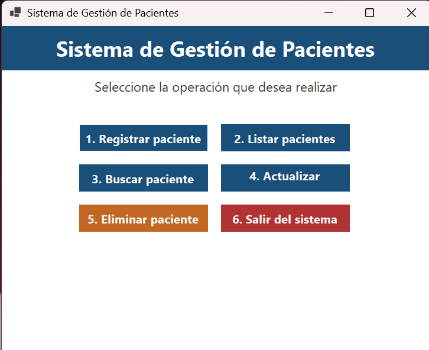

### 2. Formulario para registrar pacientes

Permite introducir el ID o cédula, nombre completo, edad, sexo, diagnóstico, estado y fecha de ingreso.

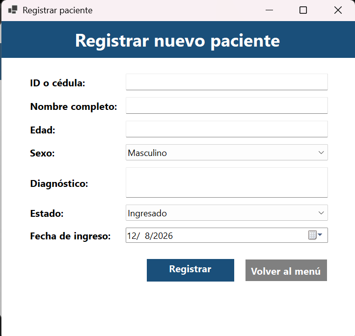

### 3. Validación de campos obligatorios

El sistema impide procesar el registro cuando falta información obligatoria.

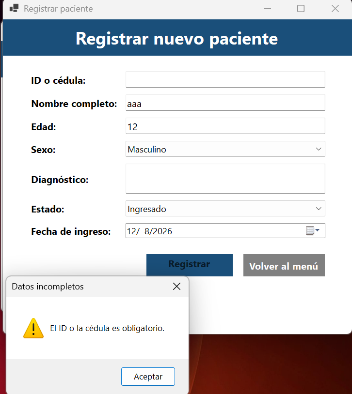

### 4. Validación de edad numérica

La edad debe contener únicamente un número entero válido.

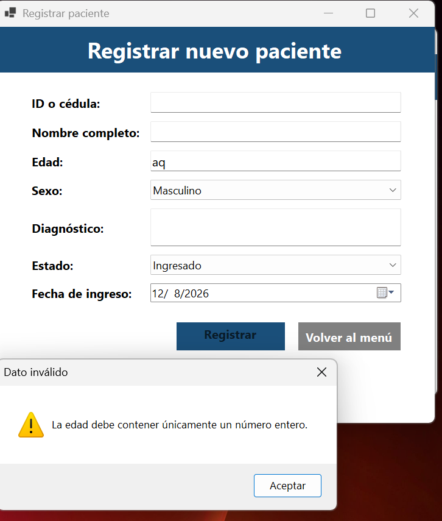

### 5. Registro exitoso

Al completar correctamente los datos, el paciente se agrega a la lista dinámica y se muestra un mensaje de confirmación.

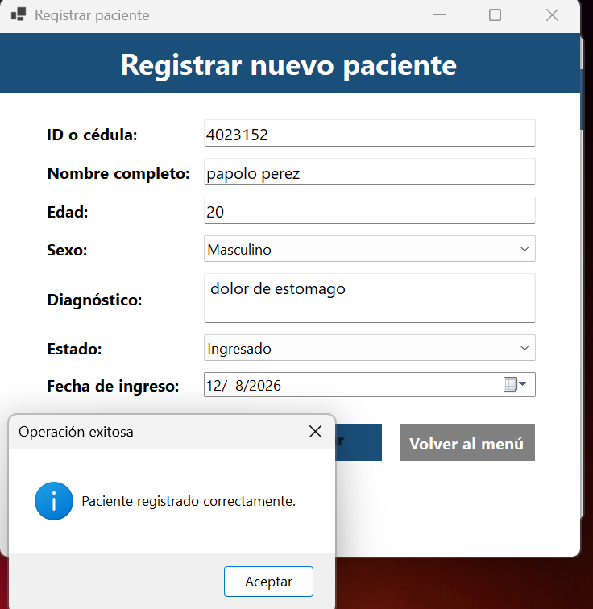

### 6. Validación de ID duplicado

El sistema evita registrar dos pacientes con el mismo identificador.

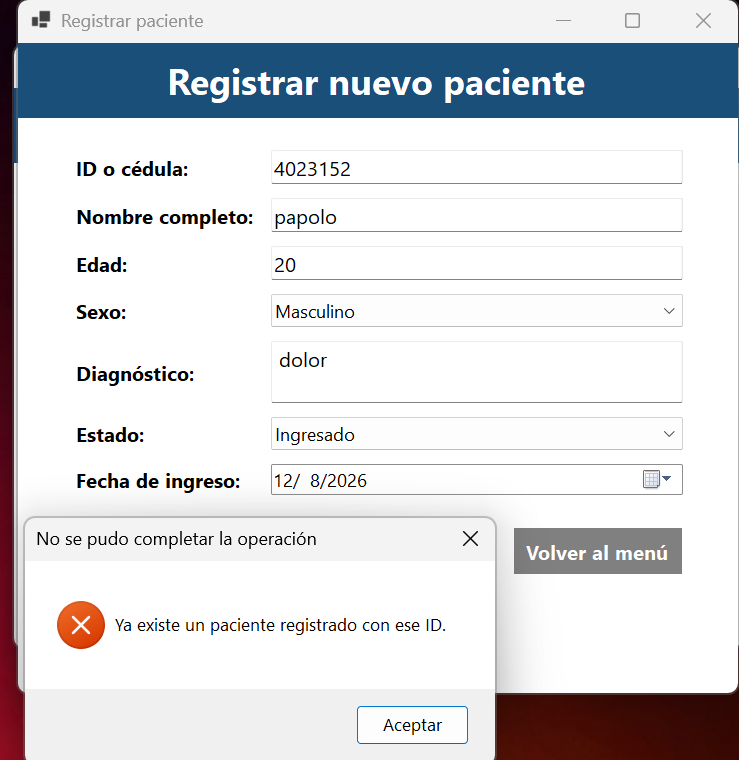

### 7. Listado de pacientes

Los pacientes registrados se presentan en un `DataGridView` con todos sus datos.

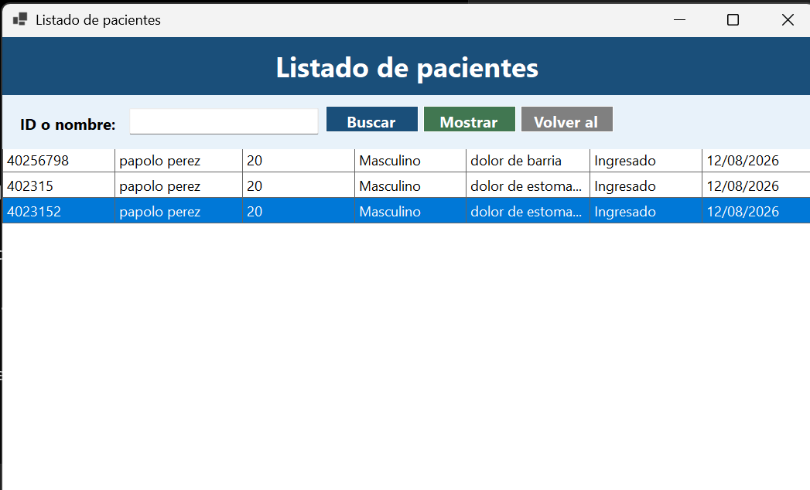

### 8. Búsqueda por ID

La consulta permite localizar un paciente mediante su identificador.

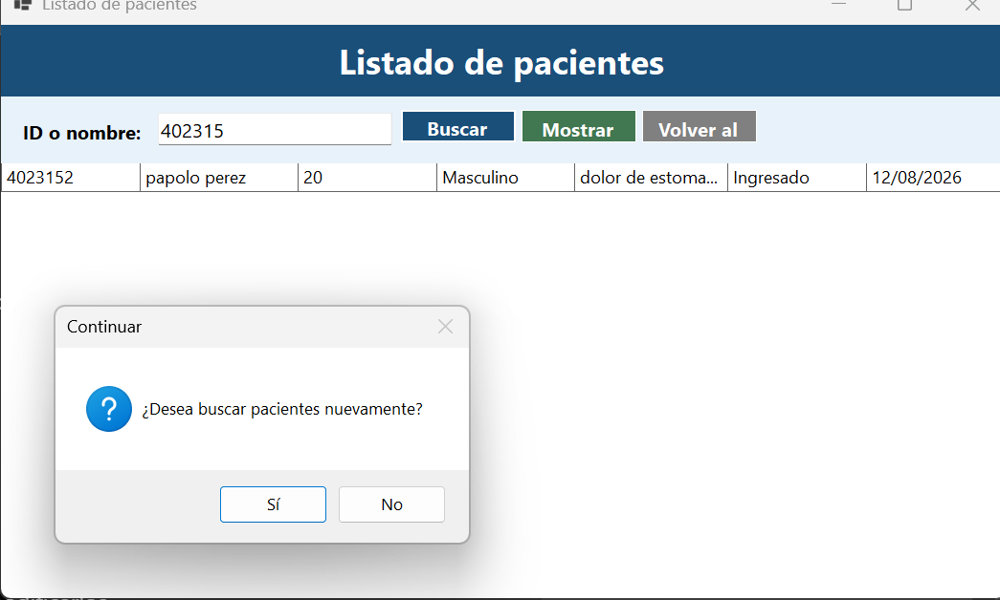

### 9. Búsqueda por nombre

También se pueden localizar uno o varios pacientes escribiendo su nombre o una parte de este.

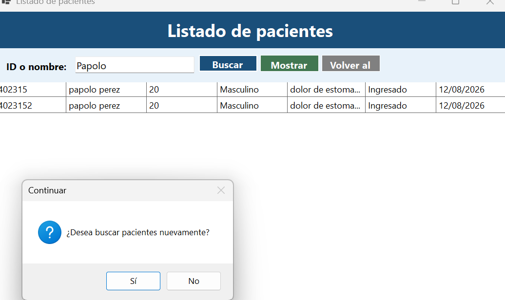

### 10. Búsqueda sin resultados

Cuando no existe una coincidencia, la aplicación muestra un mensaje de advertencia sin cerrarse inesperadamente.

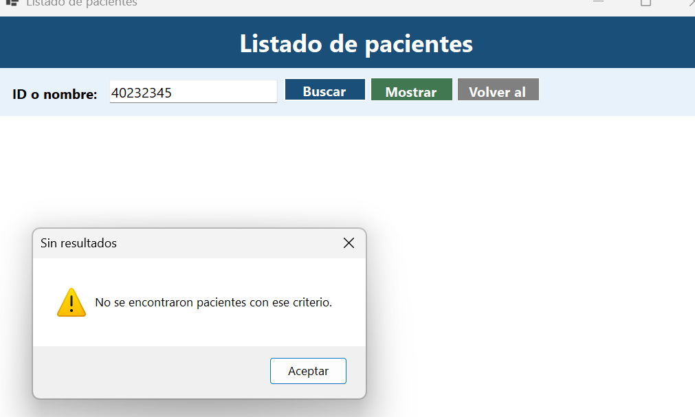

### 11. Formulario de actualización

El paciente se localiza por su ID y sus datos se cargan en el formulario para poder modificarlos.

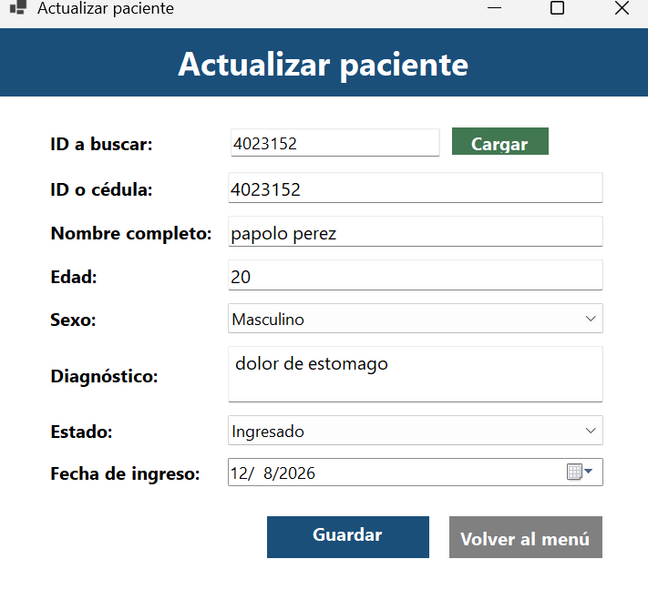

### 12. Actualización exitosa

Después de guardar los cambios, el sistema confirma que el paciente fue actualizado correctamente.

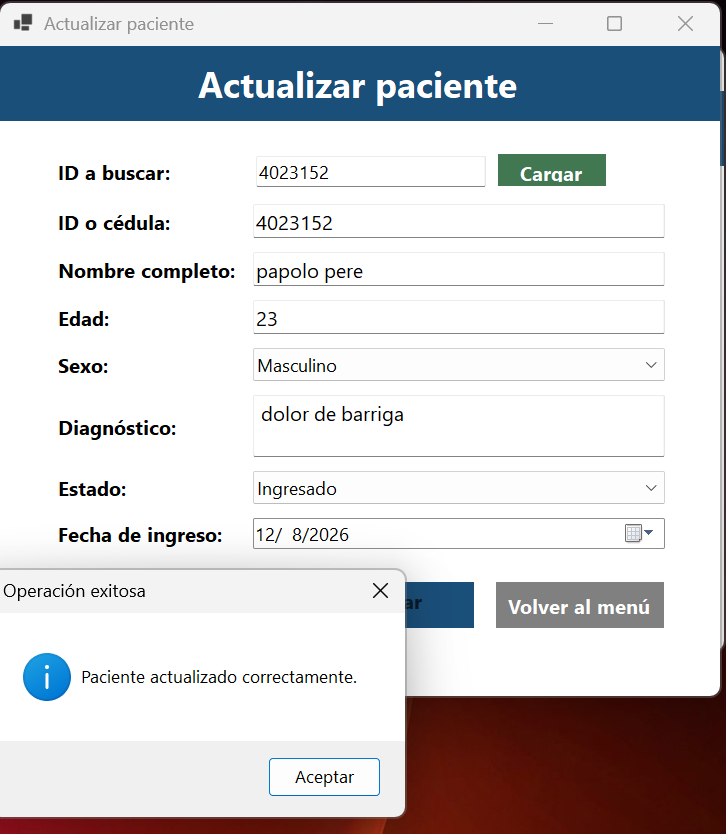

### 13. Formulario de eliminación

El formulario muestra los pacientes disponibles y permite seleccionar el registro que se desea eliminar.

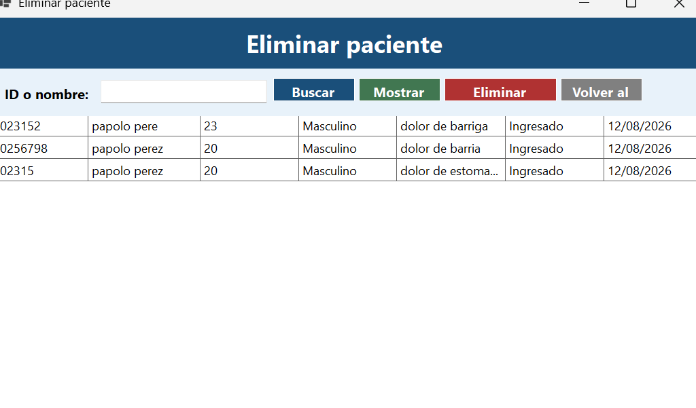

### 14. Confirmación de eliminación

Antes de eliminar el registro, la aplicación solicita confirmación mediante un `MessageBox` con botones Sí/No.

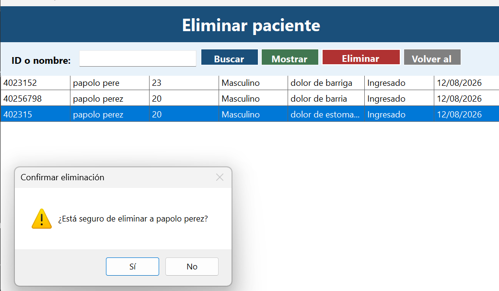

### 15. Confirmación de salida

La aplicación solo finaliza desde la opción **Salir del sistema** y solicita confirmación antes de cerrarse.

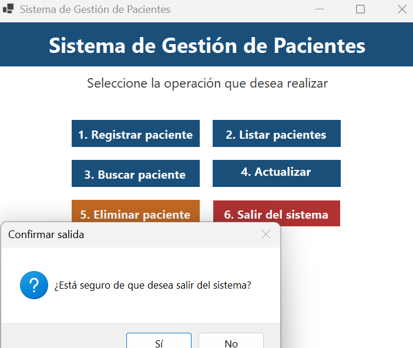

## Nota importante

Los datos se guardan únicamente en memoria, tal como solicita la práctica. Al cerrar la aplicación, la lista de pacientes se reinicia.
